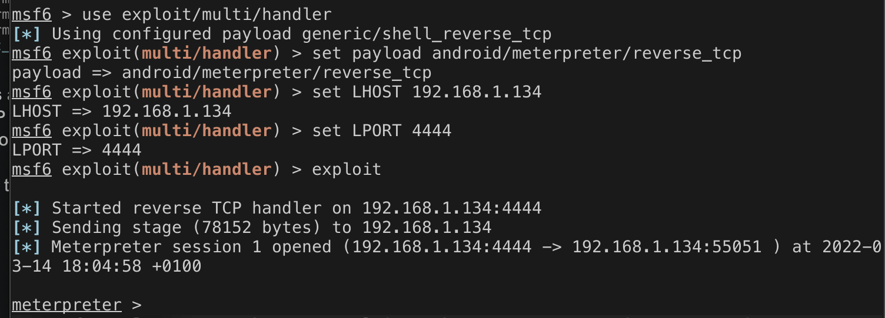
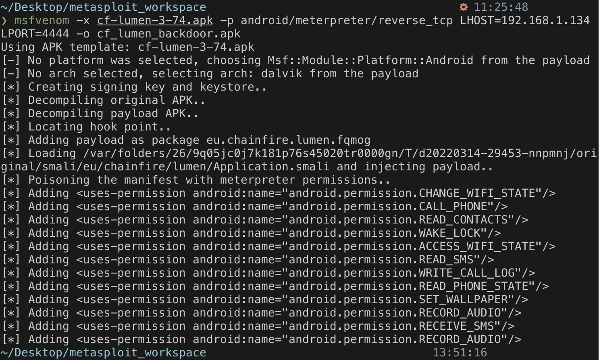

# Injecting a Payload into an application to acquire a Meterpreter
In order to acquire a meterpreter on an Android device, an APK with the payload must be installed. Various ways are possible; for example, social engineering can trick a user into downloading the payload. Another way of doing it is to inject the payload into an already existing APK and upload the trojan app online. The latter was used to get the payload on the device. The screenshot in figure 1 shows the action done using msfvenom. 

*Figure 1 - Injecting APK with msfvenom* 

The following options are passed: 
* LHOST: the IP address of the host
* LPORT: the port that the host will be listening to

The same payload and options are set on the Metasploit Framework console, and the command "exploit" is used. The commands used are visible in the figure 2. Thus, a meterpreter is obtained. The meterpreter was injected into the current process; as a result, the meterpreter has the same permissions as the original process, which means it cannot access other applications. 

*Figure 2 - Setting options on Metaasploit Framework Console*

## Sources: 
https://pentestlab.blog/2017/03/13/injecting-metasploit-payloads-into-android-applications/
