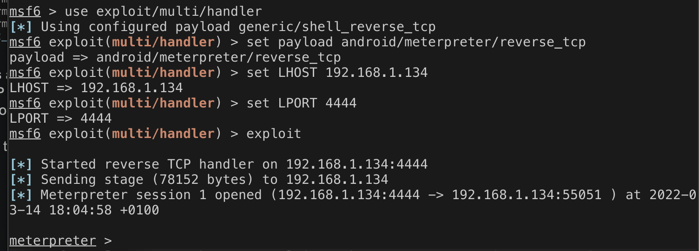

# Injecting a Payload into an application to acquire a Meterpreter
In order to acquire a meterpreter on an Android device, an APK with the payload must be installed. Various ways are possible; for example, social engineering can trick a user into downloading the payload. Another way of doing it is to inject the payload into an already existing APK and upload the trojan app online. The latter was used to get the payload on the device. The screenshot below shows the action done using msfvenom. 

*Figure 1* 
