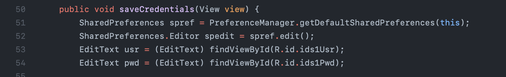
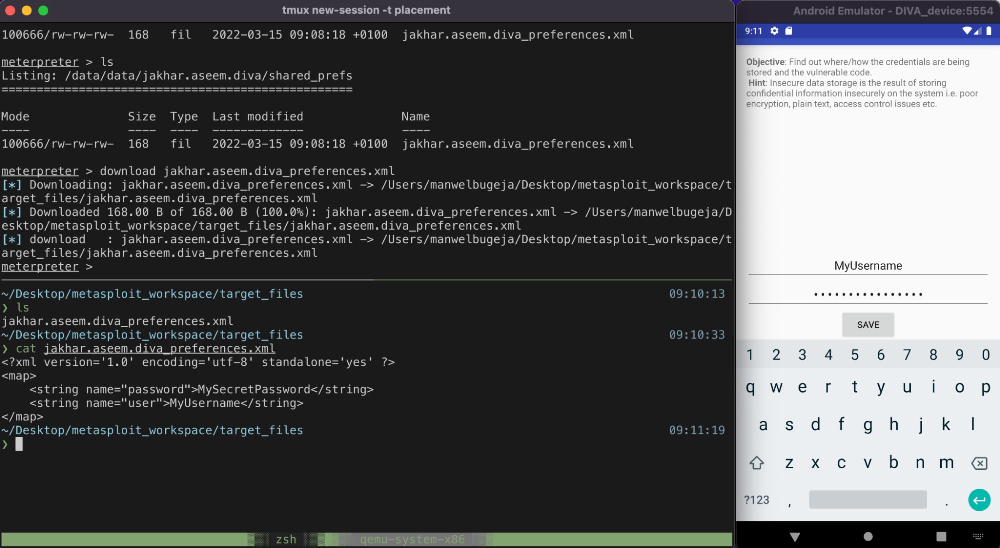
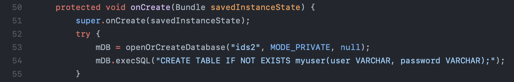
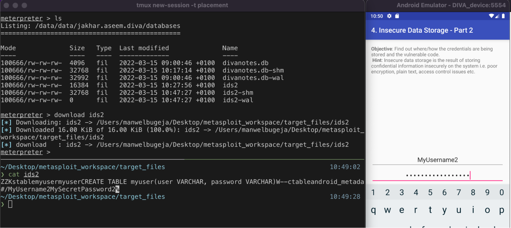
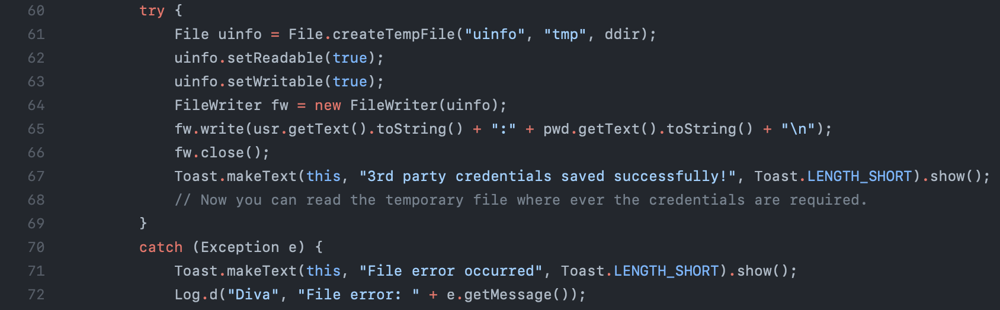
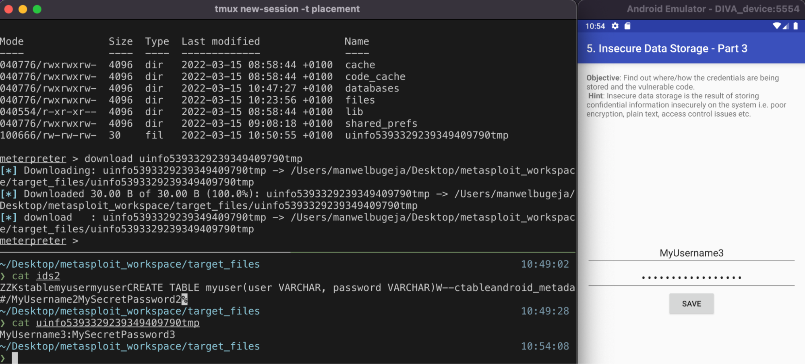
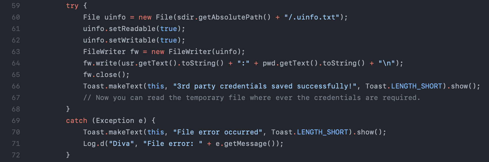
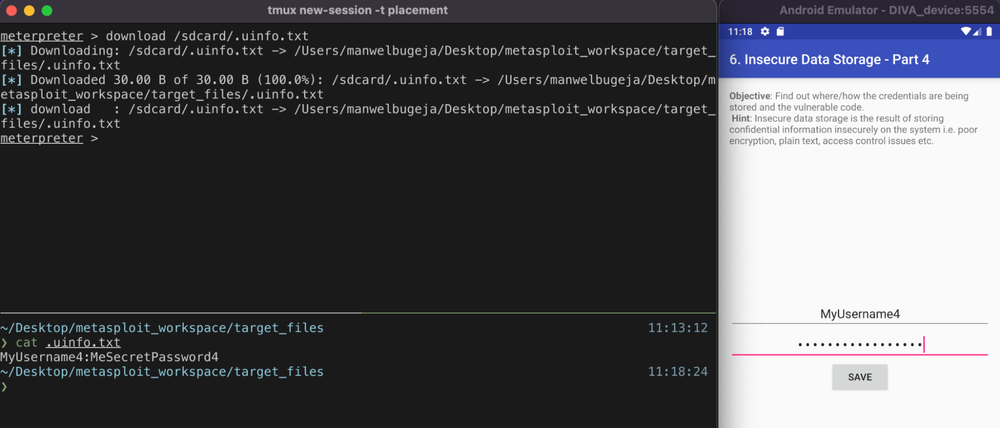
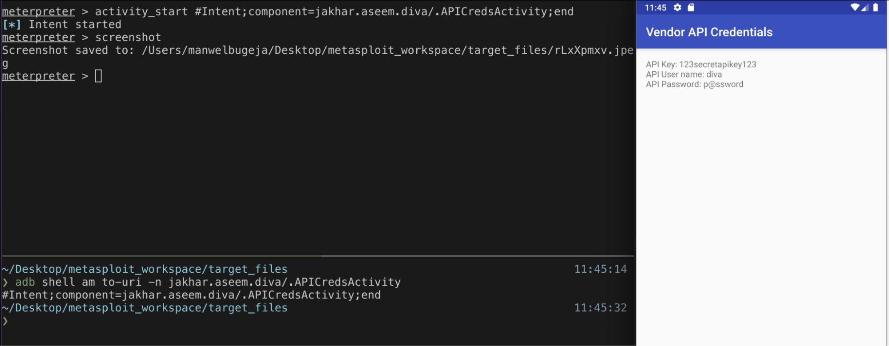

# Attacking DIVA with Metasploit 1
To attack the DIVA application, first off, the APK was injected with the payload using msfvenom. This is the first restriction of the attack; the user must have installed the trojan application and not the original one. The second restriction is that since the payload is injected in the application, it runs in the same process. This implies that the meterpreter will have the same privileges as the DIVA app, resulting in access to only the files that DIVA can access. The third restriction is that a new meterpreter session starts every time the user closes the app. With that being said, the possibilities of attacks are vast.

## Insecure Data Storage 1
The first attack targets the InsecureDataStorage1.java file. Upon inspection of the source (figure 1), the application stores the user credentials in a shared preferences file in plain text. Since the meterpreter can access the files stored in the DIVA directory, obtaining these credentials is trivial. Figure 2 shows the command used to download the file in the top pane. The bottom pane shows the file details being read on the host machine. 

*Figure 1 - Source code showing where the credentials are stored.*

*Figure 2 - Downloading and viewing the preferences file containing the credentials.*

## Insecure Data Storage 2
This attack is very similar to the first one. The only difference: the application stores the credentials in an SQLite database file instead of keeping the information in a preferences file. Figure 3 shows the application's code to reveal how it holds the data. While figure 4 shows the attack in a similar manner as the first. 

*Figure 3 - Source code showing where the credentials are stored.*

*Figure 4 - Downloading and viewing the database file containing the credentials.*
## Insecure Data Storage 3
Similar to the previous problems, this activity stores the credentials in plain text but in a regular file. This is backed up by the source code shown in figure 5. Figure 6 shows the attack in action. 

*Figure 5 - Source code showing where the credentials are stored.*

*Figure 6 - Downloading and viewing the file containing the credentials.*

## Insecure Data Storage 4
The last of the data storage problems is the most flawed of them. Apart from storing the information in plain text, the app stores the file on shared public storage. This means that all apps with permission to read external storage can view the credentials. The Metasploit attack consists of the same behaviour as the previous three. Figures 7 and 8 show the flawed code and the attack, respectively. 

*Figure 7 - Source code showing where the credentials are stored.*

*Figure 8 - Downloading and viewing the file containing the credentials.*

## Access Control Issues 1
The first one of the access control problems deals with starting an activity. The meterpreter can start activities when passed the URI. ADB shell can be used to find the URI of the desired activity. The process of identifying the URI can be seen in the bottom pane of figure 9. The top pane shows the meterpreter starting the activity. The second command gets a screenshot so the attacker can view the credentials displayed on the device. 

*Figure 9 - Starting an activity and screenshotting it to view the credentials.*
