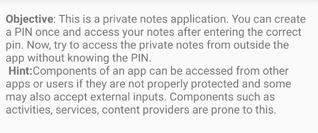
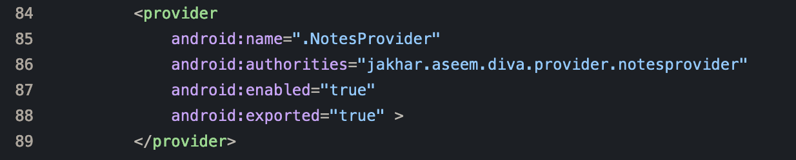
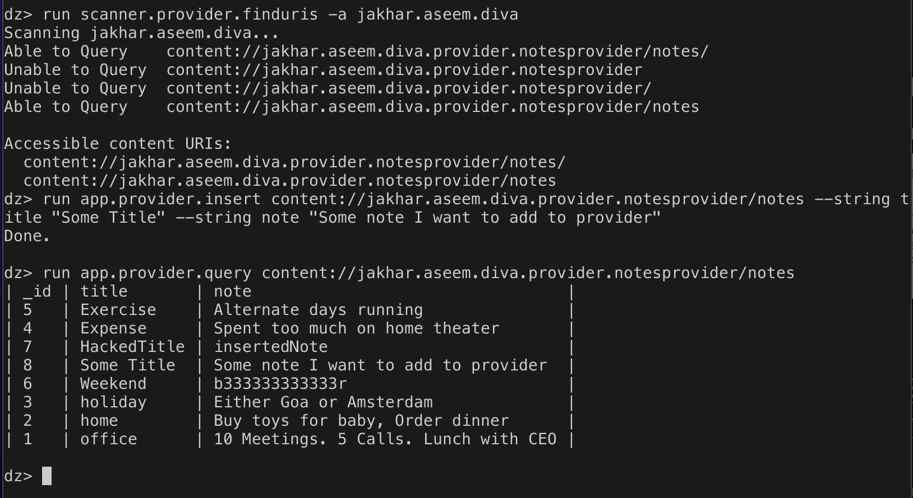

# Attacking DIVA with Metasploit 1

## Access Control Issues 3
This problem (figure 1) deals with insecure content providers, such as exporting those that do not have the necessary permissions. Such is the case in this instance, as seen in figure 2.

*Figure  1 - The problem outline.*

*Figure 2 - The problematic code.*

As of this writing, the Android meterpreter in the Metasploit Framework does not include interacting with the content provider except for downloading the database file.

Interacting with the content provider can be done with Drozer (seen in figure 3), which, similarly to the Metasploit Framework, works by sending commands to an application installed on the Android device. Subsequently, this is one way the Android meterpreter can be improved in the future. In figure 3, the first command shows identifying the content providers available, the second command showcases inserting data into the provider. The last command gets the data from the provider and outputs it. 

*Figure 3 - Accessing the provider using Drozer.*
