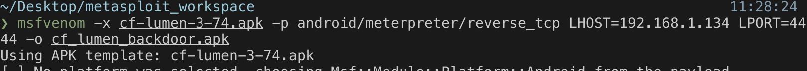
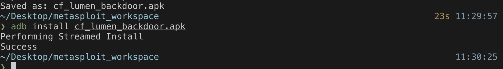
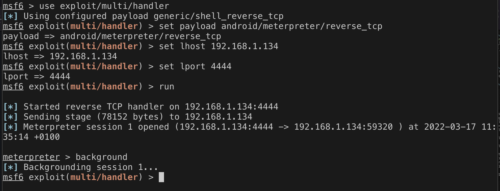
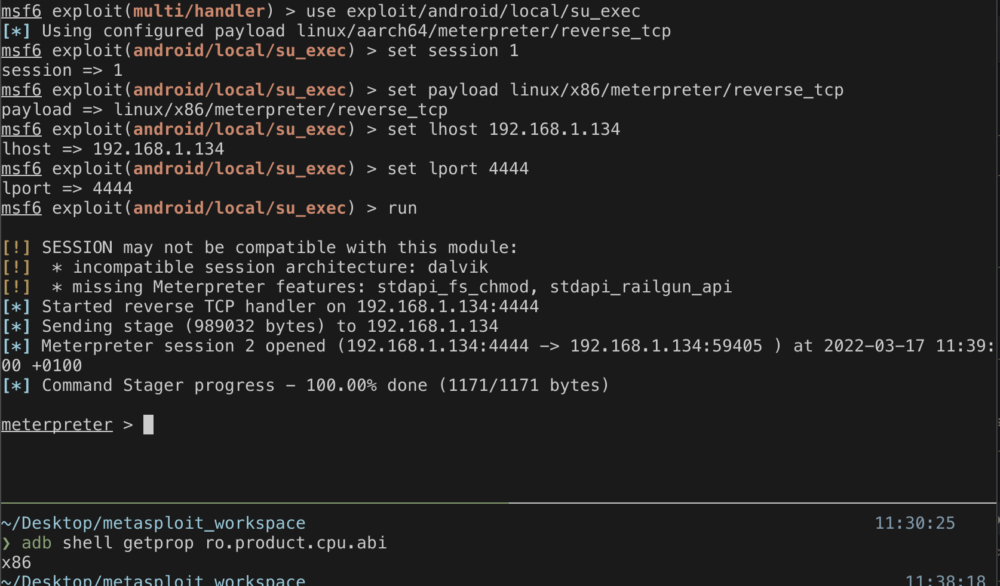
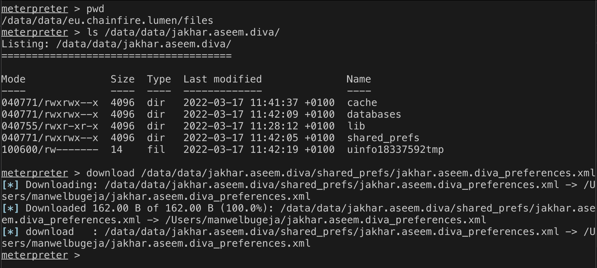

# Attacking DIVA with Metasploit 3
Injecting the DIVA application is not the only way to attack. An attacker could also inject different apps to acquire a meterpreter. However, the meterpreter would be limited to the injected application's directory; the Android sandbox makes sure it does. With that being said, Android applications can still escape the sandbox, provided the device is rooted. 

An app that requires root privileges must be granted these privileges explicitly from the user on most rooted devices. As such, it would make sense that the injected application is one that already requires these privileges so that the user would not be suspicious of the request. For this experiment, the CFLumen application was picked since it requires root privilages.  

The application is injected and installed in the device to start the attack (figures 1 and 2). After the application initialises on the device, it requests root permissions. For this test, Magisk was installed on the AVD. A meterpreter session is obtained and put in the background, as seen in figure 3. 

*Figure 1 - Injecting an application that requires root privilages.*

*Figure 2 - Installing the injected application.*

*Figure 3 - Acquiring a meterpreter session.*

The privilege escalation exploit can now be started for the meterpreter to obtain administrative rights. Figure 4 outlines this process. It is essential to note the architecture of the device in order to use the correct payload. The command in the bottom pane retrieves the CPU architecture of the device. Since this is an emulator, it has x86. If the attack was executed on an actual device, most probably, this would not be the case. 

*Figure 4 - Escalating the privilages of the meterpreter.*

Figure 4 shows the root-privileged meterpreter being successfully obtained. This meterpreter has superuser rights, meaning it can read other applications' data. The possibilities are great in number, but this text outlines attacking the DIVA application. Figure 5 shows that even though the meterpreter spawned in the process of the CFLumen app, it can access and download the data located in the DIVA application's directory. 

*Figure 5 - Attacking DIVA application.*

## Sources
https://github.com/shakalaca/MagiskOnEmulator
https://github.com/rapid7/metasploit-framework/issues/13845
https://github.com/rapid7/metasploit-framework/issues/15787
