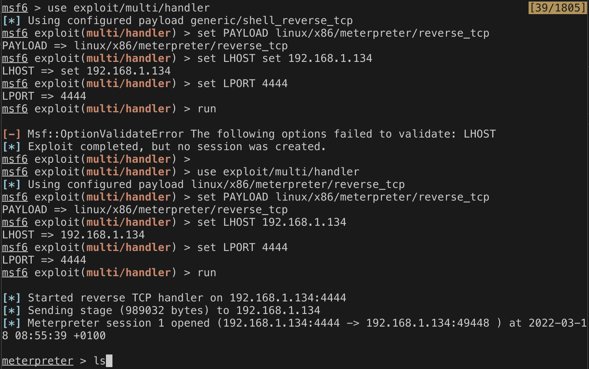
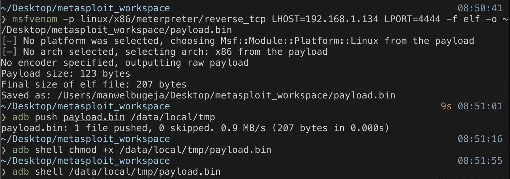
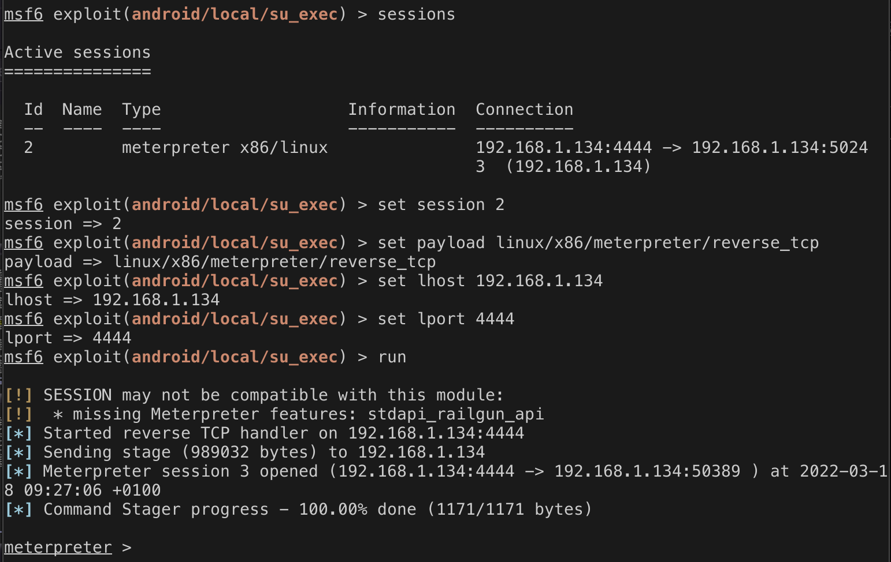
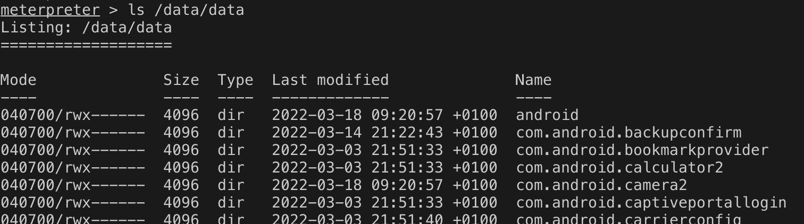

# Native Mettle Attack
This document covers attacking Android via Mettle. A payload can be generated using the msfvenom command, which produces a binary, as shown in figure 1. The architecture needs to reflect the targets' CPU architecture; in this case, the target runs in an AVD using x86. Now that a payload is available, it needs to be transferred to the Android device. In this experiment, ADB is used the binary needs to be executed via a shell command, which ADB handles easily. 

Moving on, the required options for the listener are set on the on msfconsole, as seen in figure 2. With that being said, the current meterpreter has some limitations; for example, it does not have access to the /data/data directory. As such, root access needs to be acquired to explore the Android file system freely. 

*Figure 1 - Generating a Mettle payload.*

*Figure 2 - Acquiring a meterpreter.*

Privileges can be elevated, provided the device is rooted; the root manager app may ask to grant the shell root access, depending on the settings. The privilage escalation process can be seen in figure 3. Figure 4 shows using these privilages to access the /data/data directory. 

*Figure 3 - Elevating privilages.*

*Figure 4 - Accessing /data/data.*

## Sources
https://www.infosecmatter.com/metasploit-module-library/?mm=payload/linux/x86/meterpreter/reverse_tcp
